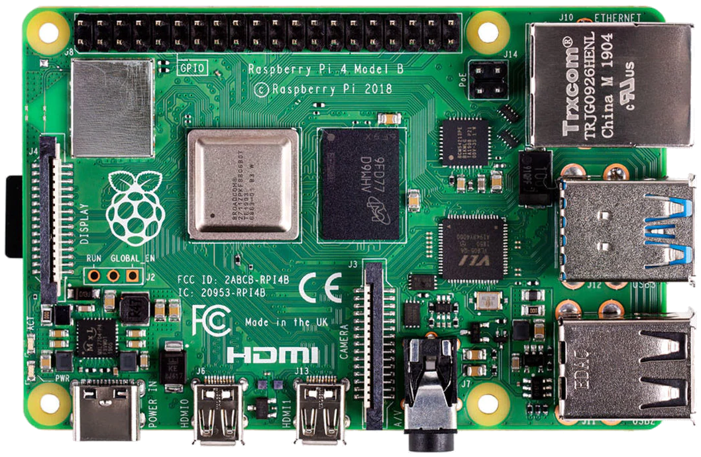
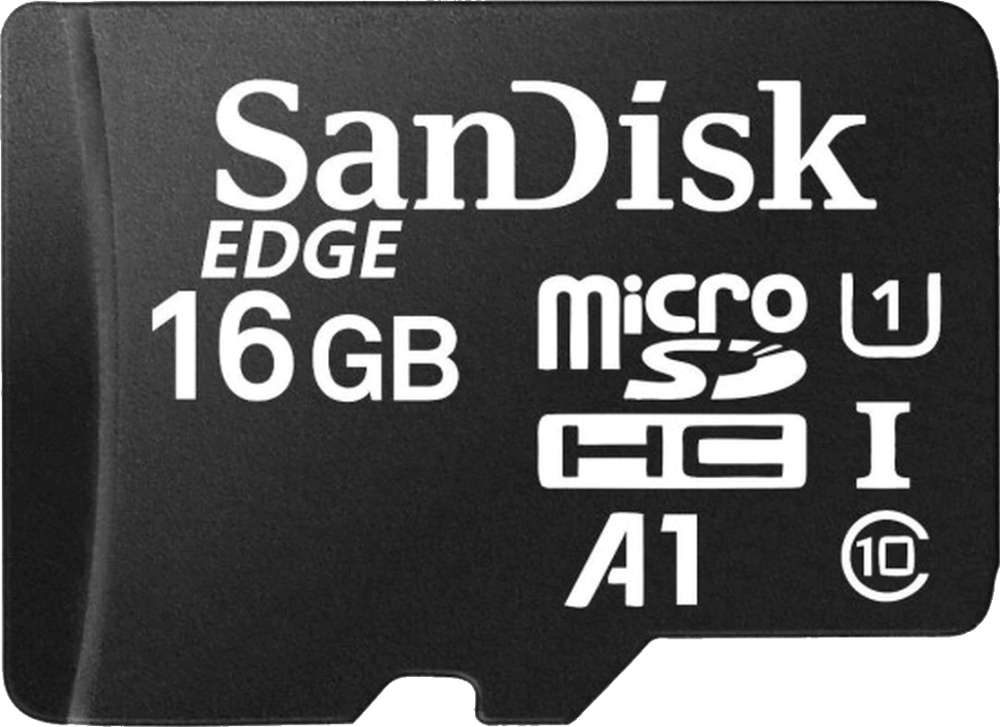
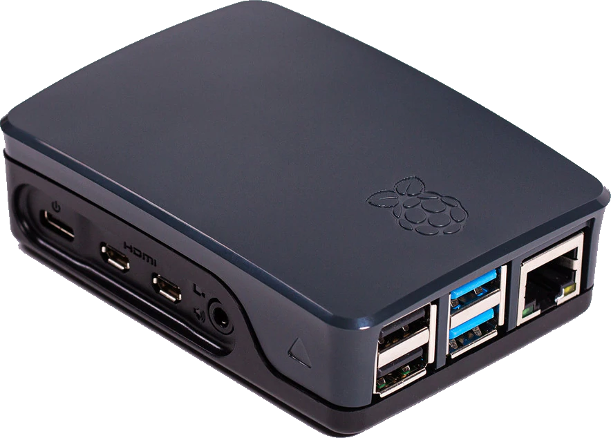
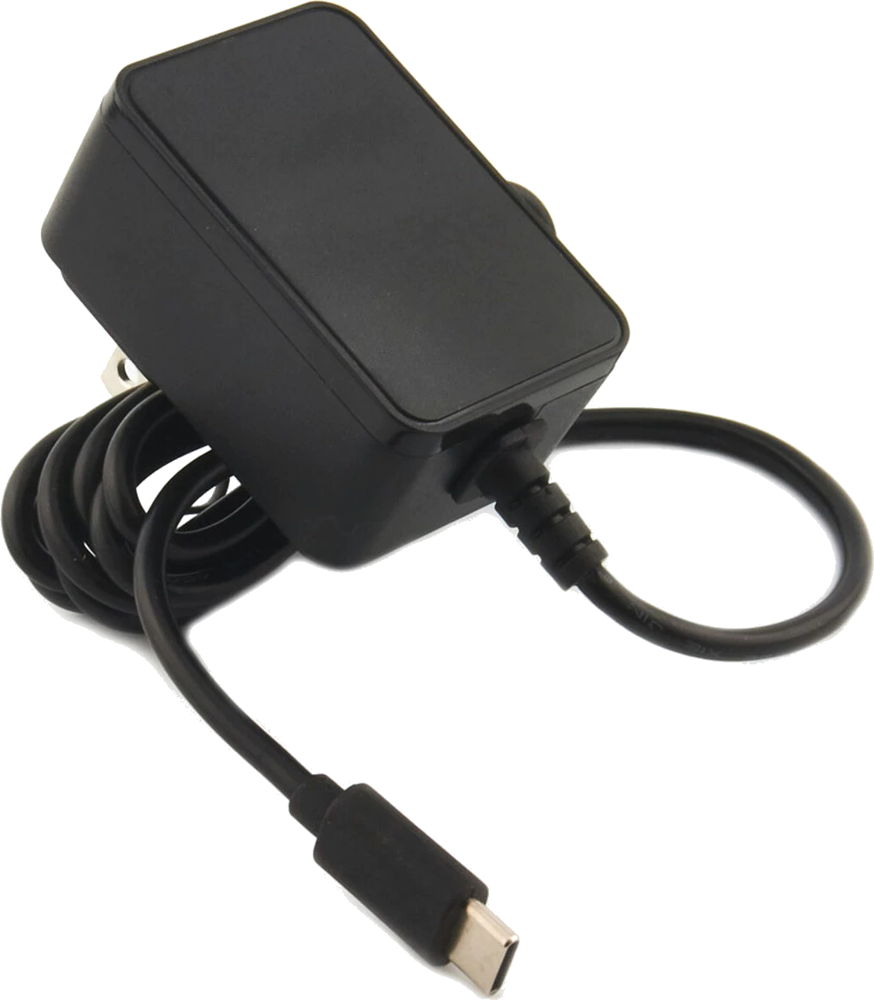

## RadiantPi Hardware

## Overview

This application was designed to run on a RaspberryPi 4. I provided the links to the parts I bough on [PiShop.us](https://www.pishop.us/) for reference, but there are many other places where they can be found.

Feel free to submit a pull-request with your favorite RaspberryPi hardware shops.

## RaspberryPi 4B 2GB ($35)

I'm not sure how much memory is actually needed, but the 2GB model was just $1 more expensive than the 1GB.

* [PiShop.us](https://www.pishop.us/product/raspberry-pi-4-model-b-2gb/)

## Micro SD Card 16GB ($7)

I picked up a blank 16GB card and then used the [Raspberry Pi OS utility](https://www.raspberrypi.org/software/) to load the operating system onto it.

* [PiShop.us](https://www.pishop.us/product/sandisk-edge-16gb-microsd-card-a1-u1-class-10-blank/)

## RaspberryPi Case ($5)

I opted for the most compact case I could find since I knew I would not need a HAT for it.

* [PiShop.us](https://www.pishop.us/product/raspberry-pi-4-case-black-grey/)

## RaspberryPi USB-C Power ($8)

This seems to be a standard USB-C power supply. If you have some laying around, you may not need this.

* [PiShop.us](https://www.pishop.us/product/usb-c-power-supply-5-1v-3-0a-black-ul-listed/)

