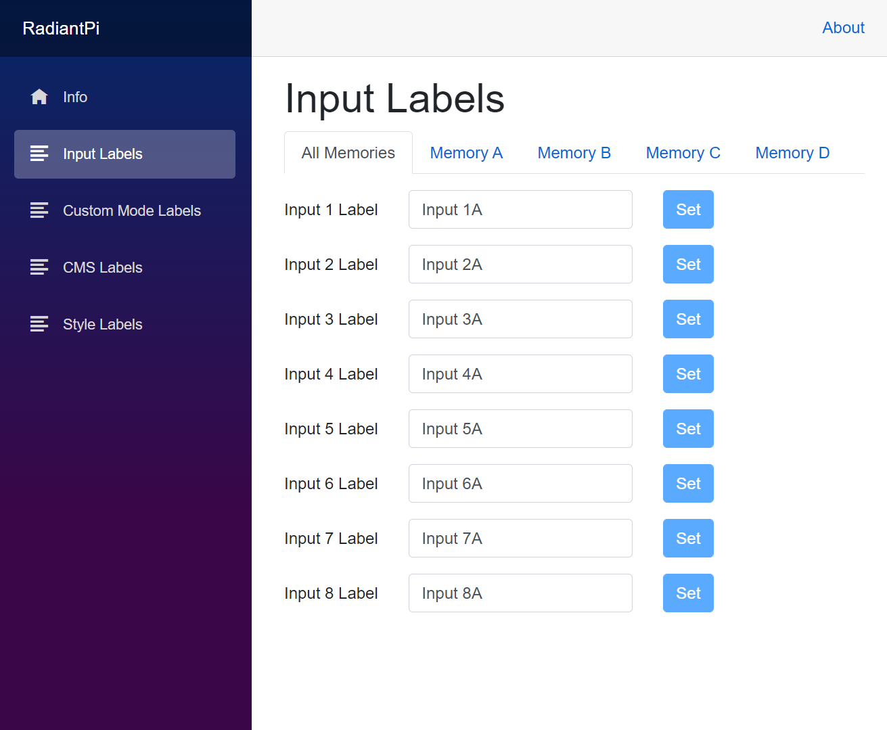



# RadiantPi (v0.1)

RadianPi is a web interface for Lumagen RadiancePro that runs on RaspberryPi.

See the [Release Notes](Docs/ReleaseNotes.md) for list of changes and additions.

## Main Features

* See model number and software revision.
* Edit labels for inputs, custom modes, CMS, and styles.

## Requirements

* RaspberryPi 4B (see [hardware guide](Docs/Hardware.md))
* [Lumagen RadiancePro](http://www.lumagen.com/)
* USB cable (Type A Male to Type B Male, included with Lumagen RadiancePro)
* (optional) Network cable

## App Setup

1. Log or SSH into the RaspberryPi.
1. [Install .NET 5](https://www.petecodes.co.uk/install-and-use-microsoft-dot-net-5-with-the-raspberry-pi/) on the RaspberryPi device.
1. Clone the RadiantPi code to your device: `git clone https://github.com/bjorg/RadiantPi.git`
1. Switch into the application folder `RadiantPi/Src/RadiantPi`.
1. Update the `appsettings.json` configuration file (see below).
1. Launch RadiantPi: `dotnet run` (check [this page](https://thomaslevesque.com/2018/04/17/hosting-an-asp-net-core-2-application-on-a-raspberry-pi/) for running RadiantPi as a service)

## App Configuration

Edit the `appsettings.json` file and update the `"RadiancePro`" section to match your needs.
```json
{
  "RadiancePro": {
    "PortName": "/dev/ttyUSB0",
    "BaudRate": 9600,
    "Mock": false,
    "Verbose": false
  }
}
```

RadiancePro Settings
* `PortName`: the name of the COM port the Lumagen RadiancePro is connected to
* `BaudRate`: (optional) the baud rate at which the application connects over the COM port (default: 9600)
* `Mock`: (optional) simulate a connected device instead (default: false)
* `Verbose`: (optional) log communication messages sent between the device and application (default: false)

> **NOTE**: RadiantPi requires the Lumagen RadiancePro to have Echo enabled:
> * MENU → Other → I/O Setup → RS-232 Setup → Echo → On

# License

This application is distributed under the GNU Affero General Public License v3.0 or later.

Copyright (C) 2020-2021 - Steve G. Bjorg