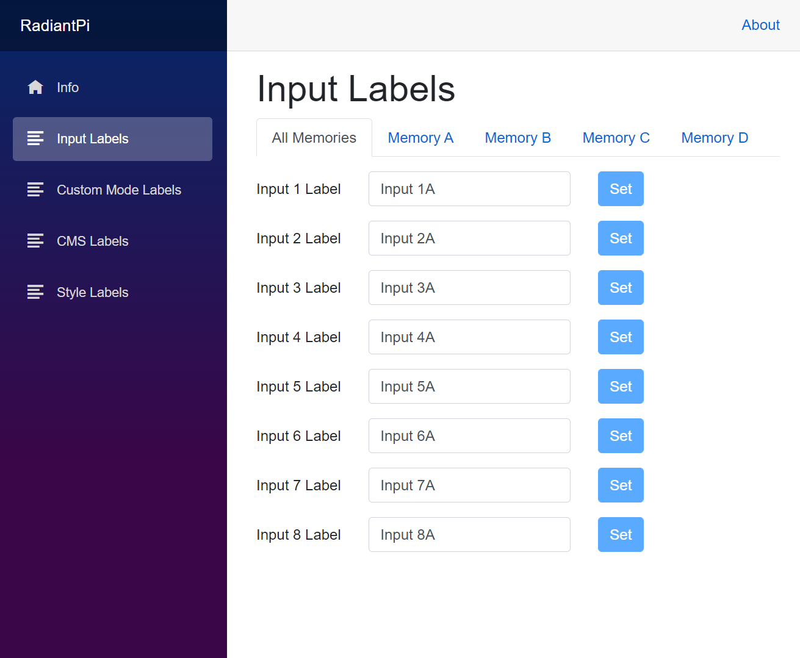



# RadiantPi (v0.2)

_RadianPi_ is a web interface for [Lumagen RadiancePro](http://www.lumagen.com/) that runs on [RaspberryPi](https://www.raspberrypi.org/).

See the [Release Notes](Docs/ReleaseNotes.md) for list of changes and additions.

## Main Features

* Display Lumagen RadianPro device status and model information
* Edit settings, such as input-, custom mode-, CMS-, and style-labels
* Trigger actions based on video mode detection

## Requirements

* RaspberryPi 4B (see [hardware guide](Docs/Hardware.md))
* [Lumagen RadiancePro](http://www.lumagen.com/)
* USB cable (Type A Male to Type B Male, included with Lumagen RadiancePro)

## App Setup

1. Log or SSH into the RaspberryPi.
1. [Install .NET 5](https://www.petecodes.co.uk/install-and-use-microsoft-dot-net-5-with-the-raspberry-pi/) on the RaspberryPi device.
1. Clone the RadiantPi code to your device: `git clone https://github.com/bjorg/RadiantPi.git`
1. Switch into the application folder `RadiantPi/src/RadiantPi`.
1. Update the `appsettings.json` configuration file (see [Configuration](Docs/Configuration.md)).
1. Launch RadiantPi: `dotnet run` (check [this page](https://thomaslevesque.com/2018/04/17/hosting-an-asp-net-core-2-application-on-a-raspberry-pi/) for running RadiantPi as a service)

## Documentation

* See [Configuration](Docs/Configuration.md) for app configuration settings.
* See [Automation](Docs/Logging.md) for automation rules and commands.
* See [Logging](Docs/Logging.md) for app logging options.

# License

This application is distributed under the GNU Affero General Public License v3.0 or later.

Copyright (C) 2020-2021 - Steve G. Bjorg